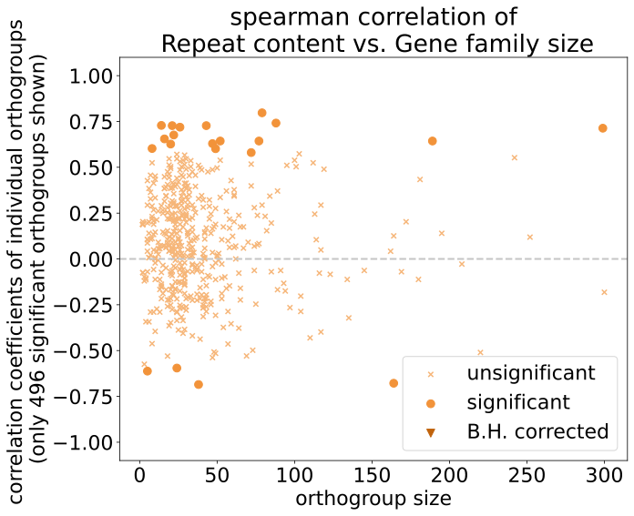

# Correlations of gene family sizes vs. species genome characteristics

We hypothesize that gene families proliferate more in genomes with a high repeat content, because some TEs can facilitate gene duplications. Therefore we calculate the linear regression in each significantly rapidly evolving orthogroup between gene family size and several genome characteristics such as genome size, overall repeat content, and repeat-category content. 

## Method 

### Phylogeneticlaly independent contrasts (PICs)

I am using my implementation of the phylogenetically independent contrasts according to Felsenstein 1985 and the species tree generated by orthofinder, transformed to be ultrametric with the ape package in R. The code is here: `PhD_chapter1/src/compute_PIC.py`. Both explanatory and response variables are transformed.

* exclude *D. melanogaster* from the analysis

### spearman correlation

I calculate the spearman correlation with the scipy function. They are NOT log transformed.

### genome characteristics

I test the gene family sizes in each orthogroup against several genome characteristics to find orthogroups that have significant correlations. Each group is FDR-corrected against multiple testing. The categories are these:

* Genome size (assembly size)
* Overall genome repeat proportion
* proportion of different repeat categories
    * Unclassified
    * Low_complexity
    * Simple_repeats
    * Rolling-circles
    * Retroelements
    * DNA_transposons
    * Small_RNA
    * Satellites

## Results 

There are 496 significantly rapidly evolving orthogroups in total, but each plot shows fewer because I excluded the ones with non-normal residuals as explained above. Each plot is the orthogroup size vs. the linear regression slope to also take into account that larger orthogroups might be more prone to correlations with repetitive elements.

No category shows significantly correlated orthogroups after multiple testing correction.

### Genome size

There are four significantly correlated orthogroups 

* N0.HOG0002345: No gene family cluster. Snurportin, snRNA import into nucleus
* N0.HOG0000761: Gene family cluster 20, transmembrane transport (olfactory). Multidrug-Resistance like Protein 1(MRP), see functional analysis for why that makes sense
* N0.HOG0000296: Gene family cluster 31, chromatin organization and transcription regulation. uncharacterized protein
* N0.HOG0000049: No gene family cluster. cag, DNA binding.

### Repeat content

This is the general genome-wide repeat content with no consideration for how it is divided in the different repeat categories

### repeat categories

There are two significant correlations:
* **Satellites:** N0.HOG0000808. No gene family cluster. Kynurenine aminotransferase, kynurenic acid biosynthetic process
* **Low complexity** N0.HOG0000056. Gene family cluster 7 (odorant binding), Odorant-binding protein 56e(Obp56e), sexual reproduction; sensory perception of chemical stimulus; sensory perception of smell

   
   

    
    

    
