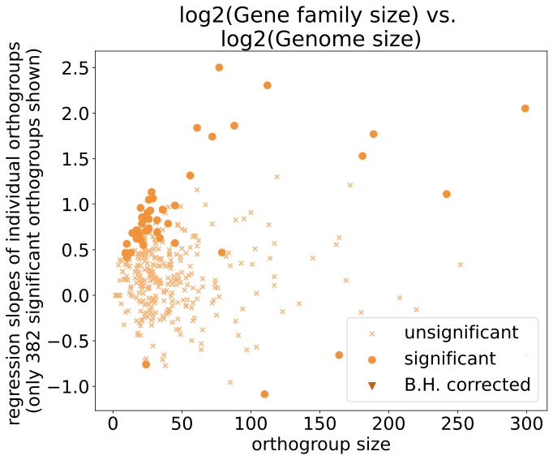
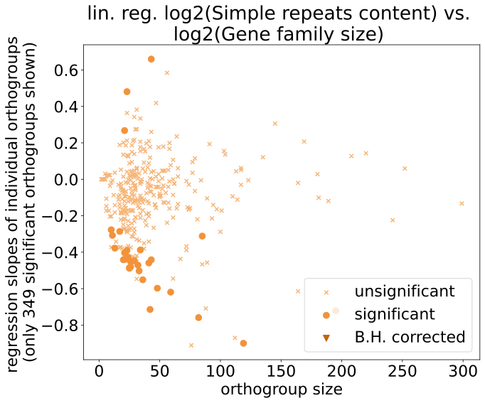
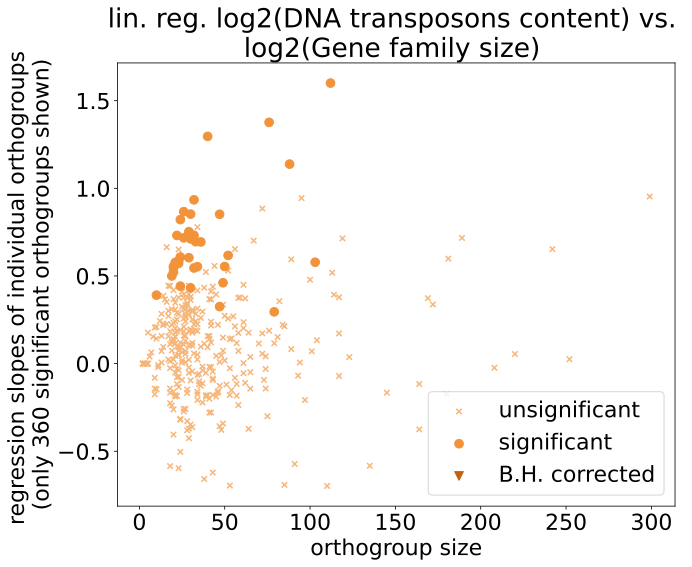
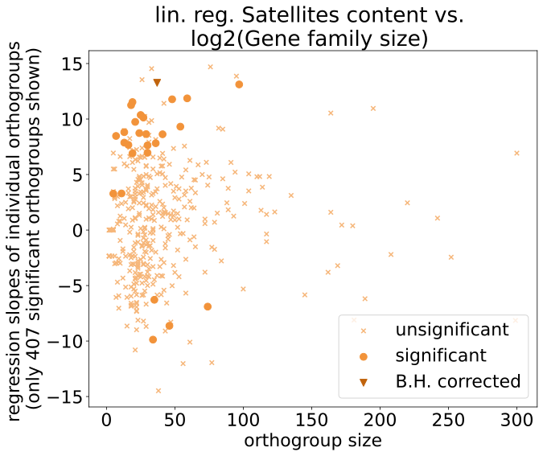

# Correlations of gene family sizes vs. species genome characteristics

We hypothesize that gene families proliferate more in genomes with a high repeat content, because some TEs can facilitate gene duplications. Therefore we calculate the linear regression in each significantly rapidly evolving orthogroup between gene family size and several genome characteristics such as genome size, overall repeat content, and repeat-category content. 

## Method 

### Phylogeneticlaly independent contrasts (PICs)

I am using my implementation of the phylogenetically independent contrasts according to Felsenstein 1985 and the species tree generated by orthofinder, transformed to be ultrametric with the ape package in R. The code is here: `PhD_chapter1/src/compute_PIC.py`. Both explanatory and response variables are transformed.

### linear regression

I am doing two things before the linear regression

* exclude *D. melanogaster* from the analysis
* Both variables are PICs log2-transformed to make them more linear. 

I am calculating the linear regression with `scipy.stats.linregress(genome_characteristic, GF_sizes)`. 

Unfortunately the sampling is pretty sparse and unequally distributed in the parameter space, and also the gene family sizes are discrete, so a lot of them don't have normally distributed residuals which makes the p-value of the regression unreliable. They often also are not suitable for non-linear regression since they also don't really follow an exponential trend or anything else that could be modelled, and the sample size is really low (13 species). They often have one member in most species and only one or two expansions. Therefore I have excluded these orthogroups from the linear models. The y-axis labels show the number of orthogroups included in every plot.

### genome characteristics

I test the gene family sizes in each orthogroup against several genome characteristics to find orthogroups that have significant correlations. Each group is FDR-corrected against multiple testing. The categories are these:

* Genome size (assembly size)
* Overall genome repeat proportion
* proportion of different repeat categories

## Results

There are 496 significantly rapidly evolving orthogroups in total, but each plot shows fewer because I excluded the ones with non-normal residuals as explained above. Each plot is the orthogroup size vs. the linear regression slope to also take into account that larger orthogroups might be more prone to correlations with repetitive elements.

No category shows significantly correlated orthogroups after multiple testing correction.

### Genome size

### Repeat content

This is the general genome-wide repeat content with no consideration for how it is divided in the different repeat categories

### repeat categories

I also checked for the percentages of the individual repeat categories but they don't have anything significant either.

    
    

    
    

The next two repeat categories have the situation where two sister species have a percentage of 0, so the PICs have a zero in them, and the log-transformation for the explanatory variable does not work, so i skipped it for them. There is one singular significant orthogroup for satellites, but since the satellite content is not log transformed I probably wouldn't put too much trust in it. 

    
