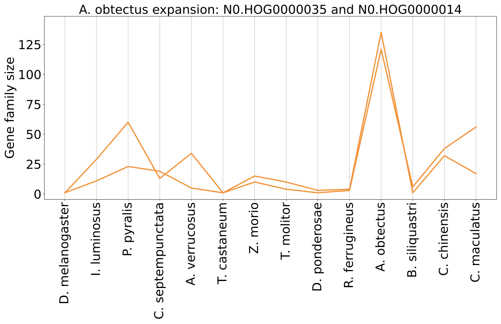
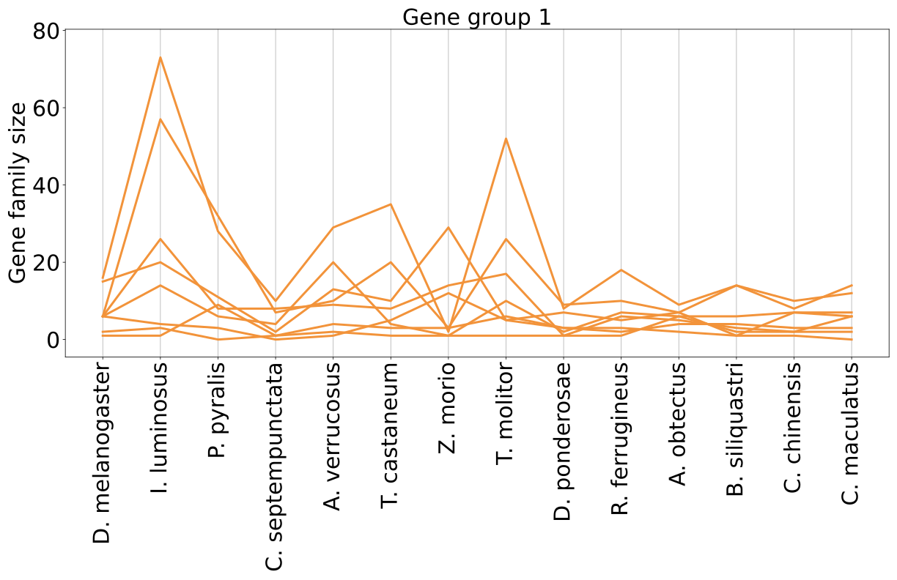
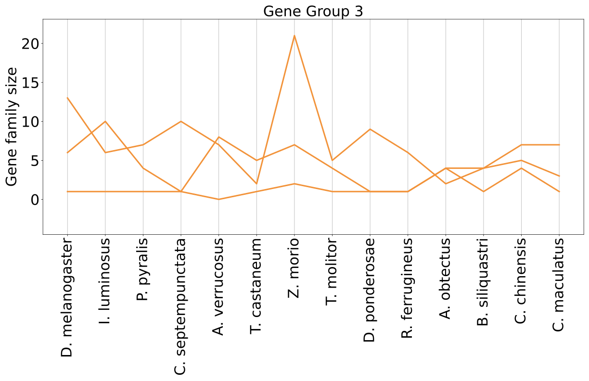
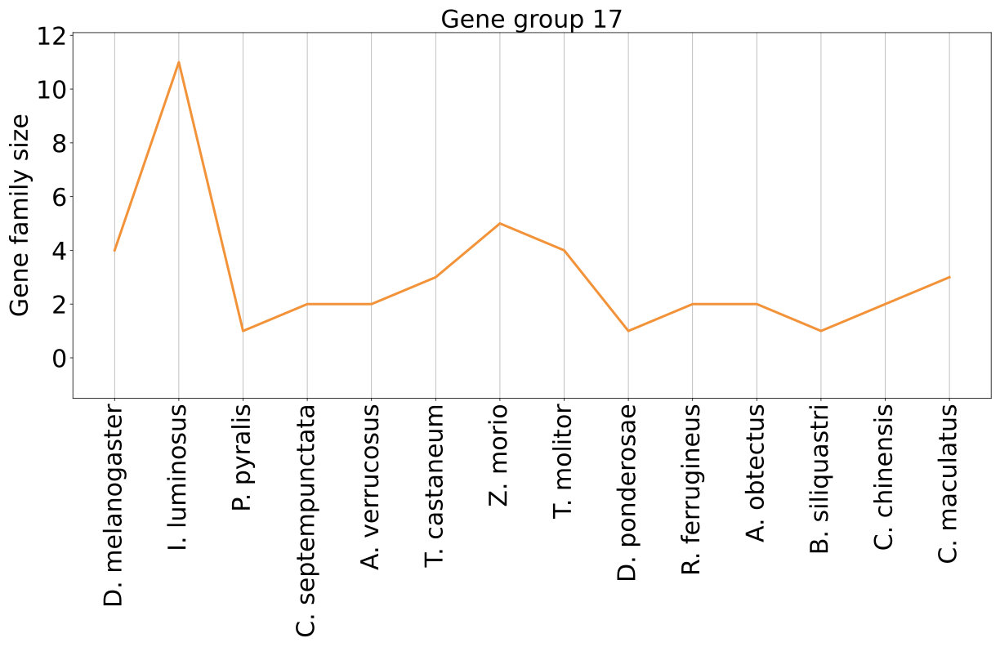
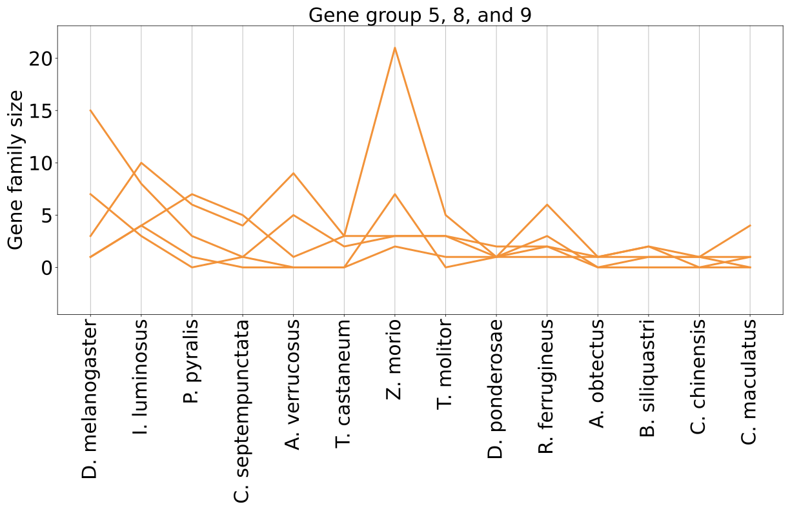
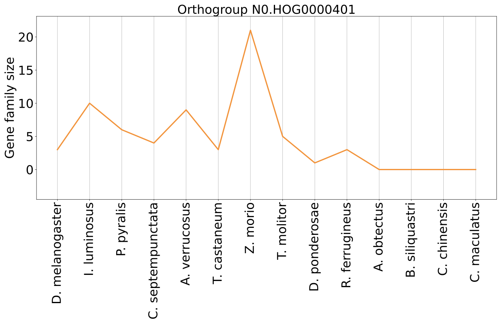
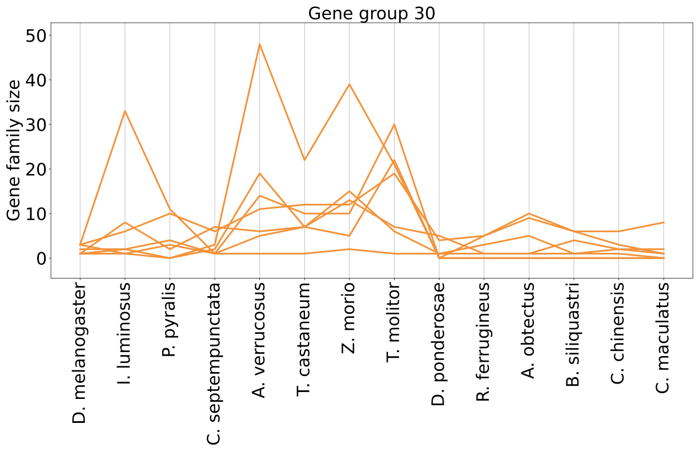
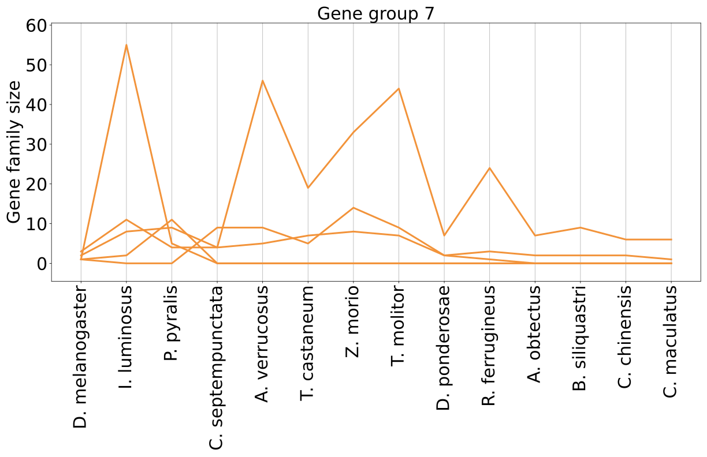
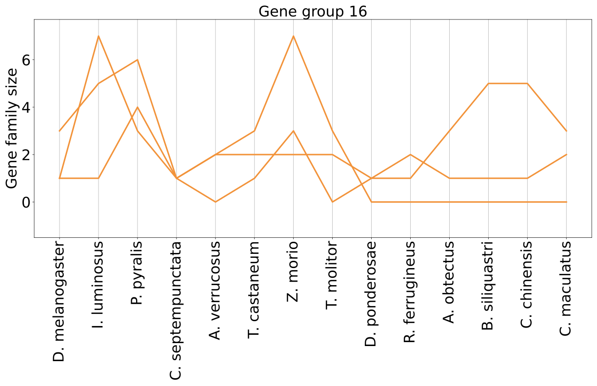
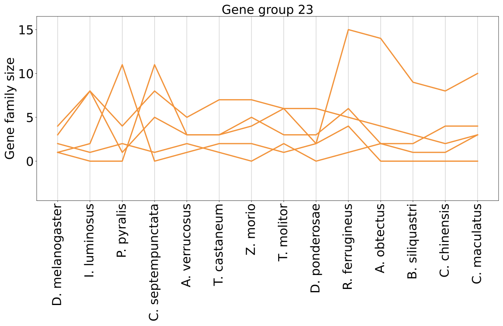

# Functional annotation of rapidly evolving orthogroups

The goal here is to identify interesting functional annotation orthogroups that can be summarized in a table in the main text. Probably like 8-15 or so. Ones that i definitely want to mention:

* Whatever is going on with the giant ones in A. obtectus
    * nothing we can figure out
* detoxification stuff about cytochrome P450
    *  some interesting stuff potentially about polyethylene breakdown in tenebrioids?
* Some stuff about the genes annotated with sexual reproduction
    * Nothing concrete
* Some stuff about the olfactory genes
    * the chitin stuff is development, not odorant binding
* The fluorescence stuff in i. luminosius and the other glowing one
  * TODO!

Other considerations:
* T. molitor and Z. morio are of particular interest because they are of industrial relevance, both as feed insects for agriculture and exotic pets, and as human food (alternative to other animal proteins). (They also use BRAKER2 and then TSEBRA manually with the default weights!! they also get high gene numbers and lots of single exon genes, especially z. morio)
    * T. molitor RNA: SRR18735292
    * z. morio RNA: SRR18735291

I am doing stuff with the table in `/PhD_chapter1/src/functional_annotation_eval.py`. 

## large expansion in *A. obtectus*

A. obtectus has two large gene families, N0.HOG0000035 and N0.HOG0000014, which are twice as large as the third largest one. The flybase IDs of these orthogroups have no functional annotation, and are not associated with any DAVID gene group. The correlation with genome size and repeat content is *significant* in both cases. Considering that most of the other orthogroups investigated here are not significant in their association, maybe that means this is not a biological signal for selection based on function, but instead the expansion is caused by drift through TE activity (and whatever the genome size does)?

## Detoxification

Gene Group 1 is the main detoxification group, with all the cytochrome P450 in it, but Gene Group 17 which has aldehyde deoxide in it also has something to do with detoxification. All of these orthogroups are very quiet in *Bruchinae* and *Curculionidae* (*D. ponderosae* and *R. ferrugineus*). Notable expansions are especially *Elateriforma* (*I. luminosus*) which are fluorescent, and *Tenebrioids*. The two functional anotations in this category are:

* cytochrome P450 (CYP) is detoxification and we think it could be related to host plant adaptation?
* Aldehyde oxidase is a part of the acetaldehyde metabolic process, which breaks down acetaldehyde into less toxic substances

*Tenebrioid* insects such as *T. molitor* and *Z. morio* can break down plasctics in their gut as larvae. This is possible through specific microorganisms in their gut working together with insect-encoded proteins that are secreted (the degradation rate of isolated microorganisms is significantly lower). [Source](https://link.springer.com/article/10.1007/s10924-023-03029-z#Sec11) for all that follows. The first step is polyethylene being oxidated by Cytochrome p450 (and others), then more chemistry (involving aldehyde dehydrogenase, which is not the same as aldehyde oxidase!), until it is broken down by lipid metabolism in the cells. According to the flybase annotations, the expression profiles of the Gene Group 1 orthogroups have their peak mostly during larval, and pupae stages, but not exclusively (some are adult sex specific). The differential expression analysis does not provide super strong evidence for CYP though.

### Gene Group 1: Cytochrome P450

This gene group is very insignificant for the correlation with both repeat content and genome size. All orthogroups in this gene group are: 
* N0.HOG0000027
* N0.HOG0000059
* N0.HOG0000095
* N0.HOG0000204
* N0.HOG0001077
* N0.HOG0000140
* N0.HOG0000492
* N0.HOG0001030

This proliferation is unsurprising (expected even?), especially in insects ([source](https://link.springer.com/article/10.1186/1471-2164-14-174), *T. castaneum* already has more duplications in the CYP superfamily than *B. mori* or *D. melanogaster*). Also detoxification, yes, but they also talk about it in relation to larval development and egg maturation. Some subfamilies (not found as significant here) have also been linked to insecticide resistance in *T. castaneum*

#### Gene Group 3: lipid metabolic process

Since the lipid metabolism in the cells is the end of the polyethylene breakdown, this gene group is also relevant:

* Gene Group 3, Function: lipid metabolic process (digestion)

It contains these orthogroups:

* N0.HOG0000086
* N0.HOG0002393
* N0.HOG0000085 (21 members in *Z. morio*!)

N0.HOG0000085 shows an expansion in *Z. morio*, which also relates to the polyethylene synthesis described above. The other two are pretty boring

Cytochrome P450 according to [this paper](https://link.springer.com/article/10.1186/1471-2164-14-174#Sec2) is also important in mitochondria, but Gene Group 33, which is mitochondrial translation shows no interesting dynamics.

### Gene Group 17: aldehyde oxidase

This gene group contains only aldehyde oxidase. The only rapidly evolving orthogroup is:
* N0.HOG0000669
which is insignificant for the correlation with repeat content and also with genome size. It is expressed during all developmental stages and adults of both sexes. There is what seems like a significant expansion in *I. luminosus*, but *I. luminosus* has a shit assembly so take that with a grain of salt.

Aldehyde is a byproduct of alcohol metabolism (in humans?) and is broken down into less toxic molecules by aldehyde oxidase. In insects, aldehyde can come from other sources, such as pheromones, and "*Long-chain, unsaturated alcohol and aldehyde compounds are common  female-produced  sex  pheromones (REF)*" ([source](https://journals.plos.org/plosone/article?id=10.1371/journal.pone.0067794)). They conclude that "*\[The\] results suggest that an antennae-specific aldehyde oxidasefrom  the  navel  orangeworm,  AtraAOX2,  might  be  involved  indegradation  of  host  plant  volatile  compounds  and  pheromone*", which helps both with distinguishing plant compounds from the pheromones they are actually interested in, and also protects them from volatile plant compounts and potentially even pesticides.

Quote from the abstract: "*Our data suggest AtraAOX2 might be involved in degradation of a diversity of aldehydes including sex pheromones, plant-derived semiochemicals, and chemical cues for oviposition sites. Additionally, AtraAOX2 could protect the insect's olfactory system from xenobiotics, including pesticides that might reach the sensillar lymph surrounding the olfactory receptor neurons.*" (I don't understand the methods or biochemistry in general enough to judge how accurate this is). 

## Sexual reproduction 

Here, the relevant Gene Groups are these:

* Gene Group 5, Function: protease inhibitor (immunity, reproduction)
* Gene Group 8, Function: immunity and sexual reproduction
* Gene Group 9, Function: sexual reproduction

Which are these orthogroups (all are unsignificant in GS and TE correlations):
* N0.HOG0000541 (Gene Group 5,Gene Group 8,Gene Group 25) (15 members in *D. melanogaster*, otherwise low family size)
* N0.HOG0000775 (Gene Group 8) (6 in *R. ferrugineus*)
* N0.HOG0000892 (Gene Group 8) (7 in *P. pyralis*)
* N0.HOG0000401 (Gene Group 9) (21 in *Z. morio*)
* N0.HOG0009002 (Gene Group 9) (4 in *I. luminosus*)
  
Similar to the detoxification, which means not a lot going on in Bruchinae and Curculionidae, but there's one massively expanding in *Z. morio* (N0.HOG0000401), whose expression peak is in adult males, and is predicted to be in the ER according to flybase, the molecular function is just protein homodimerization. Otherwise there is not a lot of info, even in *D. melanogaster*. I have a hard time finding good papers for this based on this extremely vague information.  The other orthogroups are also not super helpful, none show very interesting dynamics that I could read into.

## Pheromone sensing

This also involves cuticular proteins due to how insects actually do the sensing, so here I think these are the relevant Gene Groups:

* Gene Group 7, Function: odorant binding
* Gene Group 30, Function: pheromone sensing
* Gene Group 16, Function: chitin-related
* Gene Group 23, Function: Cuticular protein

### Gene group 7 and 30 

None of them have a significant correlation with GS or TE content except the one where I pointed it out.

* Gene Group 30: N0.HOG0000037
* Gene Group 30: N0.HOG0000177
* Gene Group 30: N0.HOG0001445 (significant correlation with GS and TE!)
* Gene Group 30: N0.HOG0000038
* Gene Group 30: N0.HOG0000194
* Gene Group 30: N0.HOG0000345
* Gene Group 30: N0.HOG0000467
* Gene Group 7 : N0.HOG0000056
* Gene Group 7 : N0.HOG0000454
* Gene Group 7 : N0.HOG0000436
* Gene Group 7 : N0.HOG0000480
* Gene Group 7 : N0.HOG0009039

The highlight is N0.HOG0000037 for Gene Group 30 and N0.HOG0000056 for Gene group 7, which make the "M" shape with the peaks at *A. verrucosus* and *Z. morio* or *T. molitor* respectively. Both of them have their expression peak in adult males.

N0.HOG0000038 (GG30) and N0.HOG0000436 (GG7) have the high peak in *I. luminosus*.

### Gene Group 16 and 23

Chitin related (GG16) and cuticular protein (GG23). No significant correlation with repeats or GS, except where I pointed it out

* Gene Group 16: N0.HOG0000307
* Gene Group 16: N0.HOG0001194
* Gene Group 16: N0.HOG0003035
* Gene Group 23: N0.HOG0000108 (significant repeat correlation!)
* Gene Group 23: N0.HOG0000039
* Gene Group 23: N0.HOG0000044
* Gene Group 23: N0.HOG0001108
* Gene Group 23: N0.HOG0000067

There is again expansions in *Z. morio*, for both categories. for GG16, it's N0.HOG0001194 and N0.HOG0003035, the former (higher peak) is only expressed in early embryonic development, but the latter is an intercellular matrix component also expressed in adults, so it might have something to do with odorants. All of Gene Group 23 is stuff only expressed during larval development and is responsible for cuticle development, nothing to do with odorant receptors.

Also this time there's stuff going on in bruchids! GG23:N0.HOG0000108 GG16:N0.HOG0000307 have expansions in bruchids. However, both of these are involved in cuticular development during larval and pupae stages, where their expression peak also happens, so this is not related to adult pheromone sensing.

## Fluorescence in *Elateriforma* (?)

TODO

# General "enrichment" of gene groups in rapidly expanding gene families

I looked at all the gene families in a species, and selected the ones that are in the upper 5th size percentile of all gene families (in species with few genes, this is sometimes just with one or more members, so I also set a min. size limit of 2). Then I checked which ones are significantly rapidly evolving according to CAFE, and which ones have been assigned to functional Gene Groups by their *D. melanogaster* member.  This is only a very small subset of all gene families in the upper 5th size percentile. I have then compiled a file that shows how many of the above selected gene families fall under each functional Gene Group. I think this can get a more general idea of the kind of things that might be evolving in some of the species. The full file is here: `PhD_chapter1/data/functional_annot_eval/frequent_Gene_Groups_in_expanding_GFs.txt` and I am going to show the output for all species below, only including Gene Groups that appear at least four times and are not uncharacterized or unannotated.

These are my conclusions: 

* Gene Group 25 (glycolysis and early development), and Gene Group 1 (detoxification, cytochrome P450) are basically in all of them.
* Gene Group 2 (proteolysis) is in all of them except bruchids (where it only occurs in B. siliquastri)
* Tenebrioids all have Gene Group 30 (pheromone sensing)
* Elateriformia all have Gene Group 4: Esterase and mating behavior.

## Shortened output of functional summary

#### D_melanogaster

number of gene families with more than 2 members (upper 5th percentile) = 506 (of 8760 orthogroups). 25 unique Gene Groups with functional annotations, these ones appear at least four times:
- 11 GFs annotated as : glycolysis and early development (and other)
- 10 GFs annotated as : protein breakdown (proteolysis)
- 6 GFs annotated as : detoxification

### Elateriformia

#### I_luminosus

number of gene families with more than 3 members (upper 5th percentile) = 1276 (of 13090 orthogroups). 27 unique Gene Groups with functional annotations, these ones appear at least four times:
- 15 GFs annotated as : protein breakdown (proteolysis)
- 11 GFs annotated as : glycolysis and early development (and other)
- 6 GFs annotated as : detoxification
- 4 GFs annotated as : Esterase and mating behavior

#### P_pyralis

number of gene families with more than 3 members (upper 5th percentile) = 1213 (of 12644 orthogroups). 27 unique Gene Groups with functional annotations, these ones appear at least four times:
- 20 GFs annotated as : glycolysis and early development (and other)
- 11 GFs annotated as : protein breakdown (proteolysis)
- 6 GFs annotated as : detoxification
- 5 GFs annotated as : transcription regulation
- 4 GFs annotated as : odorant binding
- 4 GFs annotated as : Esterase and mating behavior

### Coccinellidae

#### C_septempunctata

number of gene families with more than 2 members (upper 5th percentile) = 968 (of 10892 orthogroups). 27 unique Gene Groups with functional annotations, these ones appear at least four times:
- 16 GFs annotated as : glycolysis and early development (and other)
- 5 GFs annotated as : protein breakdown (proteolysis)
- 4 GFs annotated as : detoxification

### Tenebrionidae

#### A_verrucosus

number of gene families with more than 2 members (upper 5th percentile) = 914 (of 12405 orthogroups). 27 unique Gene Groups with functional annotations, these ones appear at least four times:
- 28 GFs annotated as : glycolysis and early development (and other)
- 10 GFs annotated as : protein breakdown (proteolysis)
- 6 GFs annotated as : detoxification
- 6 GFs annotated as : pheromone sensing

#### T_castaneum

number of gene families with more than 2 members (upper 5th percentile) = 548 (of 11778 orthogroups). 31 unique Gene Groups with functional annotations, these ones appear at least four times:
- 27 GFs annotated as : glycolysis and early development (and other)
- 8 GFs annotated as : protein breakdown (proteolysis)
- 7 GFs annotated as : detoxification
- 6 GFs annotated as : pheromone sensing

#### Z_morio
number of gene families with more than 2 members (upper 5th percentile) = 1373 (of 13008 orthogroups). 34 unique Gene Groups with functional annotations, these ones appear at least four times:
- 28 GFs annotated as : glycolysis and early development (and other)
- 12 GFs annotated as : protein breakdown (proteolysis)
- 6 GFs annotated as : pheromone sensing
- 5 GFs annotated as : detoxification
- 4 GFs annotated as : chromatin organization and transcription regulation
- 4 GFs annotated as : neurological (mostly uncharacterized)

#### T_molitor
number of gene families with more than 2 members (upper 5th percentile) = 732 (of 11174 orthogroups). 34 unique Gene Groups with functional annotations, these ones appear at least four times:
- 19 GFs annotated as : glycolysis and early development (and other)
- 8 GFs annotated as : protein breakdown (proteolysis)
- 7 GFs annotated as : detoxification
- 6 GFs annotated as : pheromone sensing

### Curculionidae

#### D_ponderosae

number of gene families with more than 2 members (upper 5th percentile) = 839 (of 10658 orthogroups): 23 unique Gene Groups with functional annotations, these ones appear at least four times:
- 24 GFs annotated as : glycolysis and early development (and other)
- 10 GFs annotated as : protein breakdown (proteolysis)
- 5 GFs annotated as : detoxification

#### R_ferrugineus

number of gene families with more than 2 members (upper 5th percentile) = 600 (of 11320 orthogroups). 23 unique Gene Groups with functional annotations, these ones appear at least four times:
- 19 GFs annotated as : glycolysis and early development (and other)
- 7 GFs annotated as : protein breakdown (proteolysis)
- 6 GFs annotated as : detoxification

### Bruchinae

#### A_obtectus

number of gene families with more than 3 members (upper 5th percentile) = 1211 (of 12608 orthogroups). 20 unique Gene Groups with functional annotations, these ones appear at least four times:
- 16 GFs annotated as : glycolysis and early development (and other)
- 12 GFs annotated as : transcription regulation
- 7 GFs annotated as : detoxification
- 5 GFs annotated as : chromatin organization and transcription regulation

#### B_siliquastri

number of gene families with more than 2 members (upper 5th percentile) = 433 (of 11255 orthogroups). 18 unique Gene Groups with functional annotations, these ones appear at least four times:
- 13 GFs annotated as : glycolysis and early development (and other)
- 5 GFs annotated as : detoxification
- 4 GFs annotated as : protein breakdown (proteolysis)

#### C_chinensis

number of gene families with more than 3 members (upper 5th percentile) = 877 (of 12655 orthogroups). 25 unique Gene Groups with functional annotations, these ones appear at least four times:
- 18 GFs annotated as : glycolysis and early development (and other)
- 6 GFs annotated as : chromatin organization and transcription regulation
- 5 GFs annotated as : transcription regulation
- 4 GFs annotated as : detoxification

#### C_maculatus

number of gene families with more than 4 members (upper 5th percentile) = 1106 (of 14402 orthogroups). 22 unique Gene Groups with functional annotations, these ones appear at least four times:
- 9 GFs annotated as : glycolysis and early development (and other)
- 5 GFs annotated as : detoxification

# Papers 

These are papers I didn't cite anywhere above but might still want to reference in my manuscript.
* tenebrioid assembly and gene family evolution: https://academic.oup.com/g3journal/article/13/6/jkad079/7099445
* beetles are super underrepresented in sequencing projects: https://doi.org/10.1073/pnas.2109019118

# TABLE

| Orthogroup_ID | CAFE_p-value | Gene_Group | Group_function | repeat_correlation_slope | repeat_correlation_p-value | GS_correlation_slope | GS_correlation_p-value | Gene_Name | D_melanogaster | I_luminosus | P_pyralis | C_septempunctata | A_verrucosus | T_castaneum | Z_morio | T_molitor | D_ponderosae | R_ferrugineus | A_obtectus | B_siliquastri | C_chinensis | C_maculatus | max_delta_GF | transcript_ID_native | Flybase |
| N0.HOG0000035 | 0.0 | None | None | 0.07833822365005534 | 0.017242915938343744 | 0.004367727725001441 | 0.011561278395119738 | None | 1 | 11 | 23 | 19 | 5 | 1 | 15 | 10 | 3 | 4 | 135 | 1 | 32 | 17 | 134 | rna-NM_001275459.1 | FBgn0037633 |
| N0.HOG0000014 | 0.0 | None | None | 0.08252868448759042 | 0.029857058816618244 | 0.00544176454054848 | 0.003931094669538225 | None | 1 | 29 | 60 | 13 | 34 | 1 | 10 | 4 | 1 | 3 | 121 | 6 | 38 | 56 | 120 | rna-NM_136949.2 | FBgn0033750 |
| N0.HOG0000140 | 0.0 | Gene Group 1 | detoxification | 0.0074300433129667505 | 0.7286375887369507 | 0.00030145542591610025 | 0.7920270858115639 | Cytochrome P450 6w1(Cyp6w1) | 6 | 26 | 8 | 8 | 9 | 8 | 14 | 17 | 1 | 6 | 5 | 3 | 2 | 6 | 25 | rna-NM_001299216.1 | FBgn0033065 |
| N0.HOG0000085 | 0.0 | Gene Group 3 | None | -0.0193651890143579 | 0.21640001185062122 | -0.0005013295348651256 | 0.5585610643744727 | uncharacterized protein(CG3635) | 13 | 6 | 7 | 10 | 7 | 2 | 21 | 5 | 9 | 6 | 2 | 4 | 7 | 7 | 19 | rna-NM_136294.5 | FBgn0032981 | 
| N0.HOG0000401 | 0.0 | Gene Group 9 | sexual reproduction | -0.022203390866792034 | 0.3806646826028459 | -0.0013093512895652032 | 0.33042982105018115 | uncharacterized protein(CG34189) | 3 | 10 | 6 | 4 | 9 | 3 | 21 | 5 | 1 | 3 | 1 | 1 | 1 | 1 | 20 | rna-NM_001103877.2 | FBgn0085218 | 
N0.HOG0000037
N0.HOG0000056